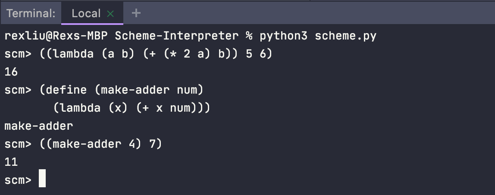

[![Contributors][contributors-shield]][contributors-url]
[![Forks][forks-shield]][forks-url]
[![Stargazers][stars-shield]][stars-url]
[![Issues][issues-shield]][issues-url]
[![LinkedIn][linkedin-shield]][linkedin-url]

<!-- TABLE OF CONTENTS -->
<details open="open">
  <summary>Table of Contents</summary>
  <ol>
    <li>
      <a href="#about-the-project">About The Project</a>
      <ul>
        <li><a href="#built-with">Built With</a></li>
      </ul>
    </li>
    <li>
      <a href="#getting-started">Getting Started</a>
      <ul>
        <li><a href="#prerequisites">Prerequisites</a></li>
        <li><a href="#installation">Installation</a></li>
      </ul>
    </li>
    <li><a href="#usage">Usage</a></li>
    <li><a href="#roadmap">Roadmap</a></li>
    <li><a href="#contributing">Contributing</a></li>
    <li><a href="#contact">Contact</a></li>
    <li><a href="#acknowledgements">Acknowledgements</a></li>
  </ol>
</details>


<!-- ABOUT THE PROJECT -->
## About The Project
<p align="center">
  
</p>

Python program that interprets the Scheme coding language. Given any Scheme code input, the program will display the corresponding output.
* Features procedures, name binding, environments, etc.

### Built With
* [Python](https://www.python.org/)

## Getting Started
### Prerequisites
* Python
  ```sh
  https://www.python.org/downloads/
  ```

### Installation

1. Clone the repo
   ```sh
   git clone https://github.com/rexliu3/Scheme-Interpreter.git
   ```

<!-- USAGE EXAMPLES -->
## Usage

Simply run `scheme.py`: ``` python3 scheme.py ```
* Type Scheme code in the terminal and the interpreter will generate the corresponding outputs


<!-- ROADMAP -->
## Roadmap

See the [open issues](https://github.com/rexliu3/Scheme-Interpreter/issues) for a list of proposed features (and known issues).


<!-- CONTRIBUTING -->
## Contributing

Contributions are what make the open source community such an amazing place to be learn, inspire, and create. Any contributions you make are **greatly appreciated**.

1. Fork the Project
2. Create your Feature Branch (`git checkout -b feature/AmazingFeature`)
3. Commit your Changes (`git commit -m 'Add some AmazingFeature'`)
4. Push to the Branch (`git push origin feature/AmazingFeature`)
5. Open a Pull Request


<!-- CONTACT -->
## Contact

Rex Liu - rexliu3@berkeley.edu

Project Link: [https://github.com/rexliu3/Scheme-Interpreter](https://github.com/rexliu3/Scheme-Interpreter)

## Acknowledgements
Built as Project in Computer Science Course [CS61A: Structure and Interpretation of Computer Programs](https://cs61a.org/) at the University of California, Berkeley


[contributors-shield]: https://img.shields.io/github/contributors/rexliu3/Scheme-Interpreter?style=for-the-badge
[contributors-url]: https://github.com/rexliu3/Scheme-Interpreter/graphs/contributors
[forks-shield]: https://img.shields.io/github/forks/rexliu3/Scheme-Interpreter?style=for-the-badge
[forks-url]: https://github.com/rexliu3/Scheme-Interpreter/network/members
[stars-shield]: https://img.shields.io/github/stars/rexliu3/Scheme-Interpreter?style=for-the-badge
[stars-url]: https://github.com/rexliu3/Scheme-Interpreter/stargazers
[issues-shield]: https://img.shields.io/github/issues/rexliu3/Scheme-Interpreter?style=for-the-badge
[issues-url]: https://github.com/rexliu3/Scheme-Interpreter/issues
[linkedin-shield]: https://img.shields.io/badge/-LinkedIn-black.svg?style=for-the-badge&logo=linkedin&colorB=555
[linkedin-url]: https://linkedin.com/in/rexliu3
